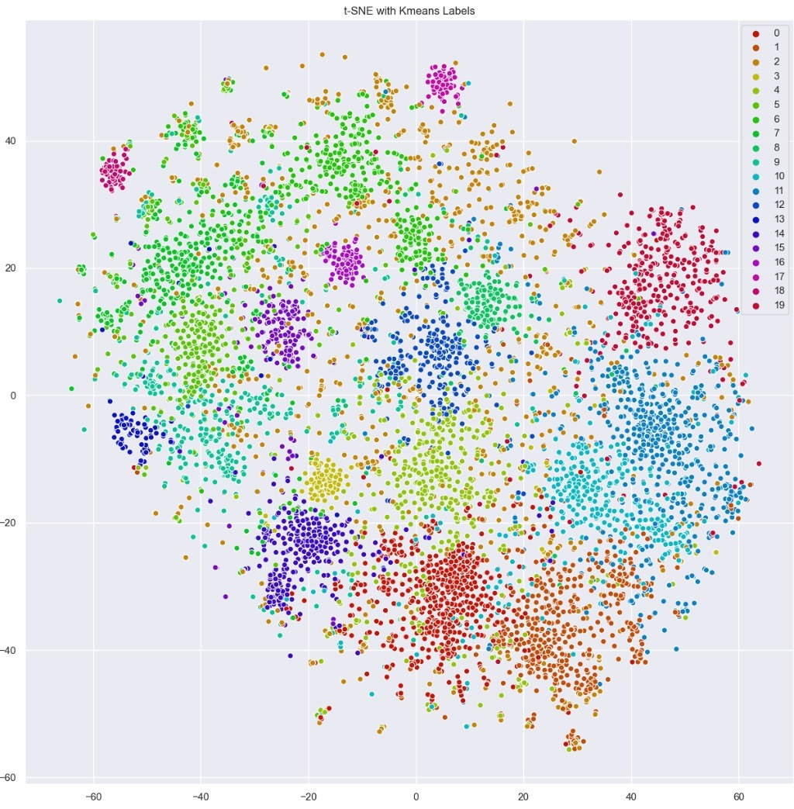

# Using NLP techniques for answering questions about COVID-19 using Kaggle Dataset
This is a summary of what was done, the full report is at [NLP_COVID_Presentation](NLP_COVID_Presentation.pptx).

## Introduction and Scope
- [COVID-19 Open Research Dataset](https://www.kaggle.com/allen-institute-for-ai/CORD-19-research-challenge)
    - ~13 GB
    - Over 135,000 scholarly articles
    - Including over 68,000 with full text
- **First goal**: What do we know about COVID-19 symptoms?
- **Second goal**: How can we cluster papers into coherent groups?

## First goal
### Words representation
- Chosen method: [GloVe – Global Vectors for word representation](https://www.aclweb.org/anthology/D14-1162/)
    1. Generate corpus using the provided dataset
    2. Create word vectors
    3. Measure cosine distance

### Words clustering
- __Main idea__: Cluster words represented by their vector using k-means algorithm

### Words cloud
- Symptoms:

- Organs:

- Medications:

## Second goal
1. Create feature vector for each paper using BOW model
2. Cluster vectors into coherent groups
3. Visualize clusters in a 2D plot

##### t-SNE with no labels:

##### t-SNE with k-means labels:

##### Interactive plot

